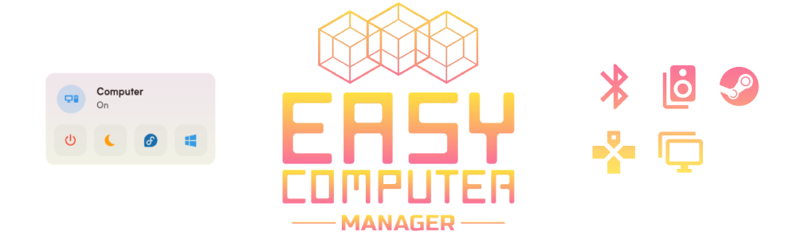

# 🖧 Easy Computer Manager

  

Easy Computer Manager is a custom integration for Home Assistant that allows you to remotely manage various aspects of your computer, such as sending Wake-On-LAN (WoL) packets, restarting the computer between different operating systems (if dual-boot), adjusting audio configurations, changing monitor settings, and more.

## Features

- Send Wake-On-LAN (WoL) packets to wake up a device.
- Restart the computer between Windows and Linux (dual-boot systems).
- Directly start the computer into Windows.
- Put the computer into sleep mode.
- Restart the computer.
- Modify monitor configurations.
- Start/Stop Steam Big Picture mode.
- Adjust audio settings (volume, mute, input, output).
- Display debug information for setup and troubleshooting.

## Installation

### Via HACS

1. Install [HACS](https://hacs.xyz/) if not already installed.
2. In Home Assistant, go to "HACS" in the sidebar.
3. Click on "Integrations."
4. Search for "easy_computer_manager" and click "Install."

### Manually

1. Download the latest release from the [GitHub repository](https://github.com/M4TH1EU/HA-EasyComputerManager/).
2. Extract the downloaded ZIP file.
3. Copy the "custom_components/easy_computer_manager" directory to the "config/custom_components/" directory in your Home Assistant instance.

## Configuration

1. In Home Assistant, go to "Configuration" in the sidebar.
2. Select "Integrations."
3. Click the "+" button to add a new integration.
4. Search for "Easy Computer Manager" and select it from the list.
5. Follow the on-screen instructions to configure the integration, providing details such as the IP address, username, and password for the computer you want to manage.
6. Once configured, click "Finish" to add the computer to Home Assistant.

## Usage

After adding your computer to Home Assistant, you can use the provided services to manage it remotely. Explore the available services in the Home Assistant "Services" tab or use automations to integrate Easy Computer Manager into your smart home setup.

## Troubleshooting

If you encounter any issues during installation or configuration, refer to the troubleshooting section in the [Wiki](./wiki) or seek assistance from the Home Assistant community.

## Contributions

Contributions are welcome! If you find any bugs or have suggestions for improvements, please open an issue or submit a pull request on the [GitHub repository](https://github.com/M4TH1EU/HA-EasyComputerManager).

Happy automating with Easy Computer Manager!