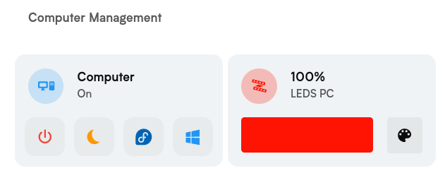

# 🖧 Easy Computer Manage

[](https://github.com/hacs/integration)



## 🐧 Configure Linux-running computer to be managed by Home Assistant.

### Enable the SSH server

Make sure to have a working SSH-server on your computer. I have only tested this integration with OpenSSH but YMMV.

On most system it can be enabled with the following commands :

```bash
sudo systemctl enable --now sshd
```

### Configure sudoers

We need to allow your user account to run specific sudo command without asking for the password so HomeAssistant can run
them.  
To do this, we need to edit sudoers file, run the following command ``visudo`` in a terminal and append the following
the to end of the file :

```
# Allow your user user to execute shutdown, init, systemctl, pm-suspend, awk, grub-reboot, and grub2-reboot without a password
username ALL=(ALL) NOPASSWD: /sbin/shutdown, /sbin/init, /usr/bin/systemctl, /usr/sbin/pm-suspend, /usr/bin/awk, /usr/sbin/grub-reboot, /usr/sbin/grub2-reboot
```

*Note : It might be necessary to allow port 22 (ssh) in your firewall.*

**⚠️ Be sure to replace username with your username.**

## 🪟 Configure Windows-running computer to be managed by Home Assistant.

To install the OpenSSH components:

1. Open Settings, select Apps, then select Optional Features.
2. Scan the list to see if the OpenSSH is already installed. If not, at the top of the page, select Add a feature,
   then:  
   Find OpenSSH Client, then select Install (optional)  
   Find OpenSSH Server, then select Install
3. Once setup completes, return to Apps and Optional Features and confirm OpenSSH is listed.
4. Open the Services desktop app. (Select Start, type services.msc in the search box, and then select the Service app or
   press ENTER.)
5. In the details pane, double-click OpenSSH SSH Server.
6. On the General tab, from the Startup type drop-down menu, select Automatic.
7. To start the service, select Start.

*Instructions
from [Microsoft](https://learn.microsoft.com/en-us/windows-server/administration/openssh/openssh_install_firstuse)*

*Note : It might be necessary to allow port 22 (ssh) in the Windows firewall altough it should be done automatically if
following the instructions from above.*

## 🖧 Configure dual-boot (Windows/Linux) computer to be managed by Home Assistant.

To configure dual-boot computer, you need to configure both Windows and Linux, for this look at the 2 sections above.  
You will need to have the same username and password on both Windows and Linux.

*Note : Be sure to enable the checkbox "Dual boot system" when adding your PC to home assistant.*

## 🔑 Why not use SSH keys?

Well, simply because it would require the user to do some extra steps. Using the password, it's almost plug and play but
compromise the security a bit.  
_In the future, the option to use SSH keys might be added depending on user feedback._

